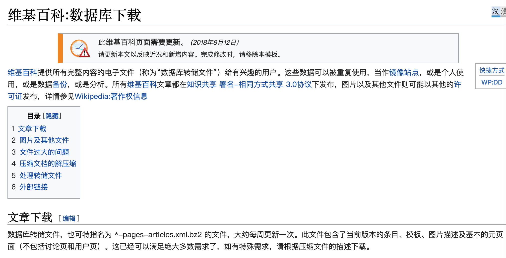
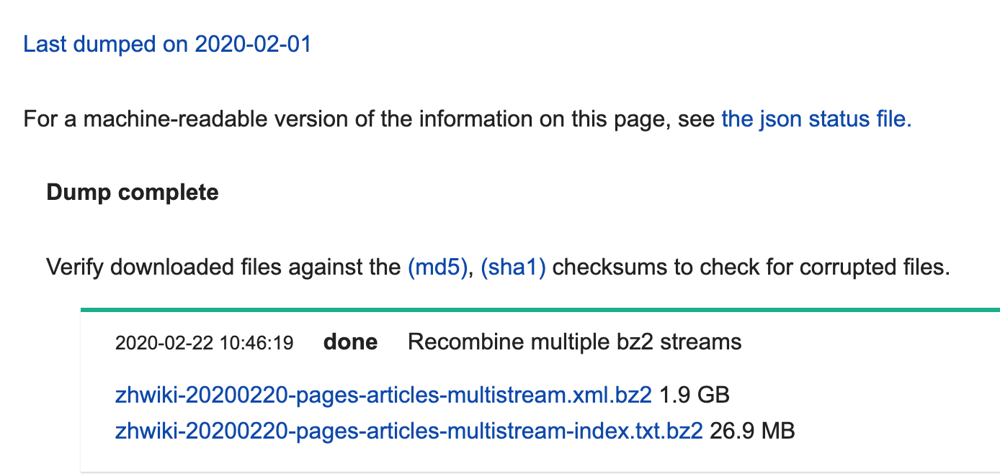

- Wikipedia维基百科

- 不用先爬虫抓取
    - 每个月都有打包，免费下载

- 数据库下载
    - 要挂VPN
    - https://zh.wikipedia.org/wiki/Wikipedia:%E6%95%B0%E6%8D%AE%E5%BA%93%E4%B8%8B%E8%BD%BD
    - 最新的存档页面，不需要VPN
        - https://dumps.wikimedia.org/zhwiki/20200301/

- [维基百科:数据库下载](https://zh.wikipedia.org/wiki/Wikipedia:%E6%95%B0%E6%8D%AE%E5%BA%93%E4%B8%8B%E8%BD%BD)
    - 

- [dumps.wikimedia.org/zhwiki/20200220/](https://dumps.wikimedia.org/zhwiki/20200220/)
    - 

- 下载链接？ 2个
    - 1.9 GB 数据库
        - https://dumps.wikimedia.org/zhwiki/20200220/zhwiki-20200220-pages-articles-multistream.xml.bz2
    - 验证文件 md5 ，26.9 MB 
        - https://dumps.wikimedia.org/zhwiki/20200220/zhwiki-20200220-pages-articles-multistream-index.txt.bz2