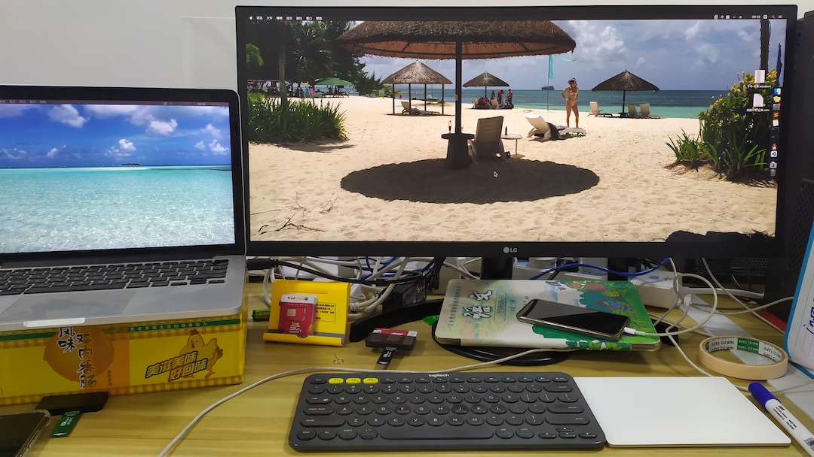

# <!-- fit --> 程序员的996，每天工作安排

---
<!-- fit -->
<!--_backgroundColor: green -->
# 上午
- 9:00
    - 上班打卡，企业微信
    - 开早会
- 9:15
    - 敏捷开发管理系统
    - 领取工作内容
---
- 9:30
    - 开始工作
    - 和产品经理沟通，battle 打嘴仗

---
<!--_backgroundColor: green -->
- 10:00
    - 摸鱼时间
    - 上厕所
    - 刷微博
- 11:00
    - 摸鱼时间
    - 上厕所
    - 刷微博
---
<!--_backgroundColor: orange -->
## 中午
- 11:55
    - 提前去食堂，避免排队
    
---
<!--_backgroundColor: pink -->
- 12:30
    - 吃完
    - 回公司吹牛
- 13:00-->14:00
    - 叹空调，睡午觉
---
<!--_backgroundColor: red -->
# 下午
- 14:00
    - 闹钟吵醒，洗脸上班
- 16:00
    - 非常困倦
    - 摸鱼
- 18:00
    - 准点离开公司
    - 吃饭
    - 散步
---
<!--_backgroundColor: pink -->
# 晚上
- 19:00
    - 加班
- 20:45
    - 敏捷开发管理系统
        - 提交工作进度
- 21:00
    - 下班打卡，企业微信
    - 准点离开公司